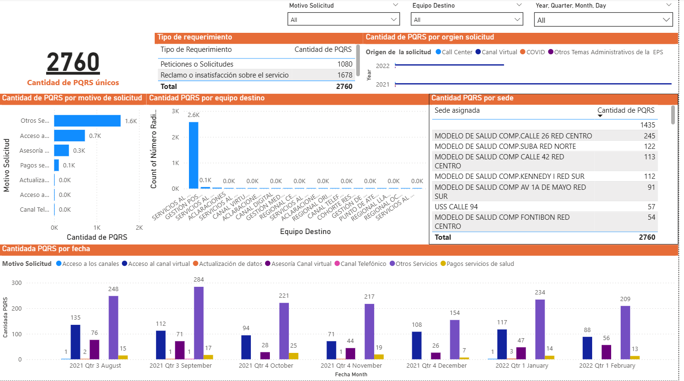
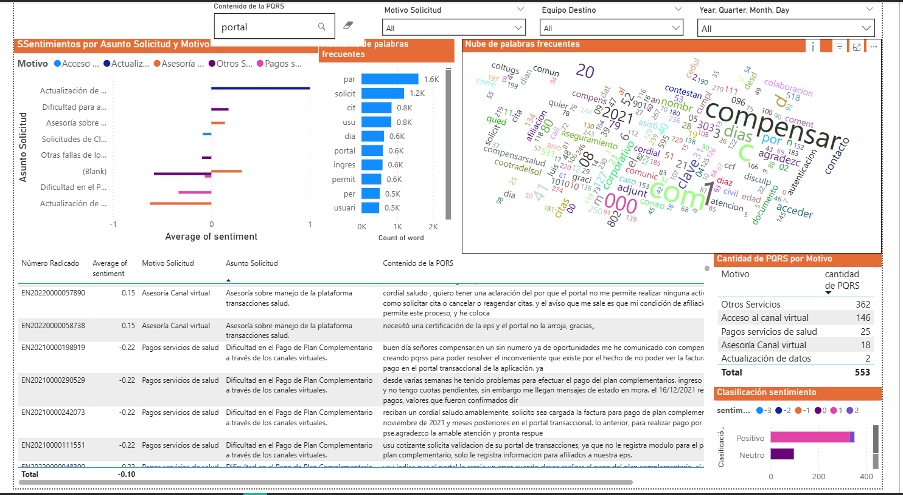

# PQRS Text Mining in the Health Industry

This repository contains R scripts and related materials for performing natural language processing (NLP) and text mining analysis on PQRS (Petitions, Complaints, Claims, and Suggestions) data within the health industry. The project aims to extract meaningful insights from textual feedback using R and visualize the results through Power BI dashboards.

## Project Overview

The objective of this project is to analyze PQRS data to understand patient concerns, identify recurring themes, and gain actionable insights for improving healthcare services. This is achieved through:

* **Text Preprocessing:** Cleaning and transforming PQRS text data using R.
* **NLP Analysis:** Applying NLP techniques to extract key information and patterns.
* **Visualization:** Creating visualizations to represent the analysis results, including word clouds, word counts, and TF-IDF scores.
* **Dashboard Integration:** Developing interactive dashboards in Power BI to provide a comprehensive view of the analysis.

## Contents

* `NLP company.R`: R script for NLP analysis, potentially tailored to company-specific requirements.
* `NLP1.R`: General R script for NLP analysis and text mining.
* `Remover acentos PQRS.yxmd`: Alteryx workflow (if applicable) for removing accents from PQRS data.
* `esstopwords.csv`: Comma-separated value file containing Spanish stop words.
* `esstopwords.xlsx`: Excel file containing Spanish stop words.
* `plot_02_word_count.png`: Image of a word count plot.
* `plot_04_word_cloud.png`: Image of a word cloud visualization.
* `plot_05_word_cloud.png`: Another image of a word cloud visualization.
* `plot_06_tf_idf.png`: Image of a TF-IDF score plot.
* `Dashboard`: Power BI dashboard file.
* `Dashboard1.PNG`: Screenshot of the first Power BI dashboard.
* `Dashboard2.PNG`: Screenshot of the second Power BI dashboard.
* `README.md`: This file.

## Methodology

1.  **Data Preprocessing:**
    * Removal of accents using the `Remover acentos PQRS.yxmd` workflow (if applicable).
    * Cleaning and tokenization of text data using R scripts (`NLP1.R`, `NLP company.R`).
    * Removal of stop words using `esstopwords.csv` or `esstopwords.xlsx`.
2.  **Text Mining Analysis:**
    * Word frequency analysis and word count visualization (`plot_02_word_count.png`).
    * Word cloud generation (`plot_04_word_cloud.png`, `plot_05_word_cloud.png`).
    * TF-IDF (Term Frequency-Inverse Document Frequency) analysis to identify important terms (`plot_06_tf_idf.png`).
3.  **Visualization and Dashboarding:**
    * Creation of visualizations in R to represent the analysis results.
    * Development of interactive dashboards in Power BI (`Dashboard`, `Dashboard1.PNG`, `Dashboard2.PNG`) to provide a user-friendly interface for exploring the insights.

## Technologies Used

* **R:** For text preprocessing, NLP analysis, and visualization.
* **Power BI:** For creating interactive dashboards.
* **Alteryx (if applicable):** For data preprocessing tasks.

## Usage

1.  Clone the repository: `git clone [repository URL]`
2.  Open the R scripts (`NLP1.R`, `NLP company.R`) in RStudio or another R IDE.
3.  Ensure that the necessary R packages (e.g., `tm`, `tidytext`, `wordcloud2`) are installed.
4.  Run the R scripts to perform the text mining analysis.
5.  Open the Power BI dashboard (`Dashboard`) to explore the interactive visualizations.
6.  View the PNG images (`plot_02_word_count.png`, `plot_04_word_cloud.png`, `plot_05_word_cloud.png`, `plot_06_tf_idf.png`, `Dashboard1.PNG`, `Dashboard2.PNG`) for static visualizations.
7.  If you have Alteryx, you can review the `Remover acentos PQRS.yxmd` workflow.

## Contact

[Alejandro Rodriguez Lozano]

[alejo1109@gmail.com]

[https://www.linkedin.com/in/andalejo/]
